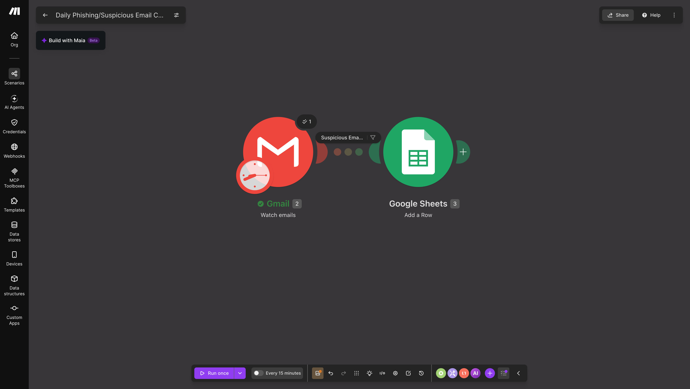

# Daily Phishing/Suspicious Email Checker

A Make.com scenario that watches Gmail for new emails, flags suspicious
ones using keyword filters, and logs them into a Google Sheet for review.

## What It Does

1. Watches Gmail inbox (All Mail) for new incoming emails
2. Checks each email against common phishing red-flag keywords
3. If a match is found, logs the email into a Google Sheet with:
   - Date received
   - Sender email
   - Subject
   - Snippet
   - Which keyword matched
   - A "Reviewed?" status (defaults to "No")

This turns constant email-checking into one simple daily review of a
spreadsheet, instead of manually spotting phishing attempts email by email.

## How to Use

1. Go to Make.com → Create a new scenario
2. Click the three-dot menu (⋮) → **Import Blueprint**
3. Upload `Daily_Phishing-Suspicious_Email_Checker_blueprint.json`
4. Reconnect the following accounts:
   - Gmail
   - Google Sheets
5. Point the Google Sheets module to your own spreadsheet
6. Turn the scenario ON, or click **Run once** to test

## Modules Used

| Module | Purpose |
|---|---|
| Gmail – Watch Emails | Trigger. Detects new incoming emails |
| Filter – Suspicious Email Check | Only lets emails through if they match a red-flag keyword |
| Google Sheets – Add a Row | Logs the flagged email's details into a spreadsheet |

## Trigger

**Gmail – Watch Emails**: checks the inbox (All Mail) for new messages.

## Filter

**Suspicious Email Check** (OR logic — passes if ANY condition matches):
- Subject contains: "verify your account"
- Subject contains: "urgent action required"
- Subject contains: "account suspended"
- Subject contains: "confirm your identity"
- Subject contains: "password expired"
- Body contains: "click here to confirm"
- Body contains: "update your payment"
- Sender email contains: "noreply"

## Action

**Google Sheets – Add a Row**: logs the flagged email's Date, Sender,
Subject, Snippet, Matched Keyword (calculated with a nested IF formula),
and sets Reviewed? to "No" by default.

## Known Limitation

The "noreply" sender condition can catch legitimate newsletters (e.g.
LinkedIn notifications), not just real phishing attempts. A future
improvement would be checking sender domains for lookalike patterns
instead of just the word "noreply".

## Test Results

Ran successfully — a test LinkedIn notification email was correctly
detected and logged with all fields populated as expected.

## Screenshot

## Files

- `Daily_Phishing-Suspicious_Email_Checker_blueprint.json` — exported scenario blueprint
- `ss.png` — screenshot of the scenario / successful run
